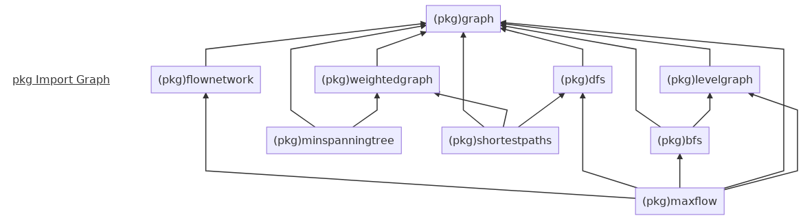

# algorithms_practice
Learn and practice algorithms and data structures. 来源包括但不限于《算法导论》, [hankerrank](https://www.hackerrank.com), [leecode](https://leetcode.com/), [北京大学 PKU JudgeOnline](http://poj.org/), etc.

## 实验环境
编译与运行主要在`Linux`上进行, 但代码都应属于平台无关的, 理论上不限于操作系统/编译器等.     
- `Ubuntu 18.04 LTS`: `WSL(Windows Subsystem for Linux) on Win10 1803-17134.228`
- `cmake version 3.10.2`
- `gcc (Ubuntu 7.3.0-16ubuntu3) 7.3.0`
- `go version go1.10.1 linux/amd64`

## 实验代码

### [Golang] 排序
- mysorts    
实现各种排序算法的实验代码, 基于`sort.Interface`来实现. (可通过命令`go test -v -bench=. -benchmem`来进行功能测试和Benchmark)     
    - `insertion_sort.go`: **O(n^2)** 实现《算法导论 第3版》 ch2.1 介绍的插入排序算法, 算法原理为从第2个元素开始遍历整个数组, 对每个元素, 向前进行遍历比较, `Less()`条件为`false`则`Swap()`, 直到`Less()`条件为`true`是退出. 由于是`in-place`实现, 空间复杂度为 **O(1)**.     
    - `merge_sort.go`: **O(n*log(n))** 实现《算法导论 第3版》 ch2.3 介绍的归并排序算法. 算法原理为分治法(归并排序其实是二分法), 即将问题分解为2个子问题, 求解每个子问题(对于每个子问题可递归地继续分解, 直至不可分割), 然后递归地向上合并子问题的解.    
        - `aux array based implementation`: 书上介绍的方法, 每次`merge`时需要对每个子问题申请一块辅助的子数组内存来暂存子问题, 空间复杂度为 **O(n)**. 时间复杂度为 **O(n*log(n))**, 缺点为需要申请额外的空间, 以及无法使用典型的`Swap`接口来实现排序过程.    
        - `in-place implementation`: 不需要辅助空间的实现, 借鉴了`insertion_sort`的方法来实现`merge`时的`in-place`. 空间复杂度为 **O(1)**. Benchmark 实测的运行时间比`aux array based implementation`慢很多, 接近`insertion_sort`(比它稍快).    

### [Golang] 最大子数组问题
- maxsubarray    
解决最大子数组问题([Maximum Subarray Problem](https://en.wikipedia.org/wiki/Maximum_subarray_problem))的实验代码.    
    - `divide_and_conquer_algorithm.go`: **O(n*log(n))** 实现《算法导论 第3版》 ch4.1 最大子数组问题 中介绍的基于分治法([Divide and Conquer Alogrithm](https://en.wikipedia.org/wiki/Divide_and_conquer_algorithm))的实现. 其基本原理为将原数组分解为两个子数组, 分别求解两个子数组的最大子数组及同时跨两个子数组的最大子数组, 取最大值为最大子数组. 递归地执行这个过程直至求到最终解.      
    - `violent_solution.go`: **O(n^2)** 实现暴力方法求解, 即遍历所有子数组的可能, 从而取出最大子数组.     

### [Golang] 图算法

- graph     
通常使用符号 **G(V, E)** 来表示一张图, 其中 **V** 为点数, **E** 为边数. 此`pkg`定义了一堆表示`graph`的类型与通用接口, 支持包括邻接链表(Adjacency List)和邻接矩阵(Adjacency Matrix)两种图的表示方法. 其中点通过从`0`开始的`uint`来表示, 所以邻接链表和邻接矩阵都基于了基础的`slice`来实现. 基础概念可参考《算法导论 第3版》 ch22.1 图的表示.     
注: 图论中的各种涉及到路径的算法, 通常都基于`point-to-point`来讨论, 而不是`edge-to-edge`, 从`graph`的表现形式就可以反映出这一点.     

- graphsample1     
来自《算法导论 第3版》ch22.2 广度优先搜索 中的示例`Undirected Graph`, 基于上面的`package graph`的定义的实现, 从而方便后续的实验.    

- graphsample2    
来自《算法导论 第3版》ch22.1 中的示例`Directed Graph`, 基于`package graph`的定义的实现, 从而方便后面的实验.    

- graphsample3    
来自《算法导论 第3版》ch22.3 中的示例`Directed Acyclic Graph`, 基于`package graph`的定义的实现, 从而方便后面的实验.    

- graphsample4    
来自《算法导论 第3版》ch22.5 Strongly Connected Component 中的示例`Directed Graph`, 基于`package graph`的定义的实现, 从而方便后面的实验.    

- graphsample5    
来自《算法导论 第3版》ch23.2 Kruskal和Prim算法 中的示例`Undirected Graph`, 基于`package graph`和`package weightedgraph`的定义的实现, 从而方便后面的实验.    

- bfs    
    - **O(V+E)**    
    - 实现《算法导论 第3版》ch22.2 广度优先搜索 中的算法描述, [Breadth First Search](https://en.wikipedia.org/wiki/Breadth-first_search). 基本思路为搜索过程中从`queue`(借助其先入先出的特性)头上取下一次迭代的初始节点, 并将迭代到的节点存储到`queue`尾, 从而实现**广度优先**. 搜索过程中的`tree`的信息及`depth`等通过节点属性的形式保存在一个节点数组中.    
    - 提供了基于`bfs`的生成`level graph`的实现, 以供`dinic`算法使用.    

- bfs_main    
执行`package bfs`代码的`main`.     

- dfs    
    - **O(V+E)**    
    - 实现《算法导论 第3版》ch22.3 深度优先搜索 中的算法描述. 本书章节中的伪码是基于递归的描述, 比较清晰易懂也容易实现. 实际`coding`时同时参考[Depth-first search - Wikipedia](https://en.wikipedia.org/wiki/Depth-first_search)实现了基于栈的实现. 注: 基于栈的实现一般来讲结果会和递归的实现不太一样, 主要是遍历的次序关系.    
    - 《算法导论 第3版》ch22.4 拓扑排序([Topological Sorting](https://en.wikipedia.org/wiki/Topological_sorting)) 也是依赖 [Depth-first search - Wikipedia](https://en.wikipedia.org/wiki/Depth-first_search) 的方法来实现的, 故其实现也放在了`dfs`包中. 由于`graph`中若存在环是无法拓扑排序的, 所以拓扑排序只能基于[Directed Acyclic Graph](https://en.wikipedia.org/wiki/Directed_acyclic_graph), 依据此也可以通过`dfs`判断一个`graph`是否为[Directed Acyclic Graph](https://en.wikipedia.org/wiki/Directed_acyclic_graph).    
        - 拓扑排序的一个典型应用: 比如要做一个[Continuous Delivery](https://en.wikipedia.org/wiki/Continuous_delivery)比较复杂的Pipeline(Pipeline上许多步骤间有依赖关系), 那么便可以先把步骤的依赖关系图先画出来, 算出拓扑排序, 再按照拓扑排序的顺序来梳理Pipeline的流程.    
    - 《算法导论 第3版》ch22.5 强连通分量([Strongly Connected Component](https://en.wikipedia.org/wiki/Strongly_connected_component)) 同样依赖2次 [Depth-first search - Wikipedia](https://en.wikipedia.org/wiki/Depth-first_search) 实现, 于是实验代码也放在`dfs`包中. 第一次基于默认`graph`进行`DFS`, 然后以`timestampF`倒序作为第二次遍历的`node`顺序; 第二次基于`graph`的转置(反转所有`edge`)来进行`dfs`, 然后以`timestampF`正序来进行遍历并输出[Strongly Connected Component](https://en.wikipedia.org/wiki/Strongly_connected_component), 以每个`dfs tree`的`root`作为切分.    
        - 注: 第一次`dfs`后的`timestampF`倒序, 看起来为上述拓扑排序的结果的倒序即可. 但实际上主要区别在于拓扑排序的`graph`必须无环, 而切分强连通分量几乎必然有环(否则就只好每个`node`为一个强连通分量). 所以并不能直接调用拓扑排序的函数实现.    
  
- levelgraph    
`Dinic`算法所要用到的分层图, 即以[Depth-first search - Wikipedia](https://en.wikipedia.org/wiki/Depth-first_search)在`graph`上进行搜索, 以每个`node`的`depth`作为`level`.    

- flownetwork    
描述[maximum flow problem](https://en.wikipedia.org/wiki/Maximum_flow_problem)的流网络, 主要包含基于`directed graph`的图以及图上每两个`node`间(i.e. `edge`)的容量. 需要注意的是两个`node`间只能有单向的`edge`, 不能有反向. 同时为了描述[maximum flow problem](https://en.wikipedia.org/wiki/Maximum_flow_problem)问题, 也记录了入点和出点.    
NOTE: `flownetwork` 与 `weightedgraph` 非常相似, 所以其实完全可以基于`weightedgraph`来实现. 此处仅仅是因为`flownetwork`有点类似于描述[maximum flow problem](https://en.wikipedia.org/wiki/Maximum_flow_problem)的一个专用数据结构, 所以减少了依赖. 有必要的时候可以进行 refactor 以去除重复代码.    

- maxflow    
[maximum flow problem](https://en.wikipedia.org/wiki/Maximum_flow_problem)的算法实现, 包括`FordFulkerson`, `EmondsKarp`, `Dinic`, etc. 在其内部的`_test.go`中以[Drainage Ditches](http://poj.org/problem?id=1273)问题作为典型的测试用例.    
    - `FordFulkerson`: **O(E|f|)**  基础的最大流问题解决方法. 定义了`flow`, `residual network`, `augmenting path`等重要的基础概念, 以及解决问题的一般思路.    
    - `EmondKarp`: **O(V(E^2))** 基于`FordFulkerson`, 在如何寻找`augmenting path`的方法上进行了扩展优化, 即以[Breadth First Search](https://en.wikipedia.org/wiki/Breadth-first_search)来寻找点到点的最短路径, 效率更高.    
    - `Dinic`: **O((V^2)E)** 依然是基于`FordFulkerson`的方法, 最主要的区别在于在生成`residual network`后, 先采用[Breadth First Search](https://en.wikipedia.org/wiki/Breadth-first_search)来生成分层图(`level graph`, 以每个`node`的`depth`作为其层次), 再在`level graph`上寻找`blocking flow`(即直到不能再找到新的`flow`), 以此`blocking flow`作为`residual network`上的`augmenting flow`.     

- maxflow_main    
调用`maxflow`以解决[maximum flow problem](https://en.wikipedia.org/wiki/Maximum_flow_problem), 支持从`stdin`来构造`flownetwork`, 以更容易测试新的问题.     

- weightedgraph    
即在`package graph`定义的`directed/undirected graph`的基础操作上, 为每个`edge`增加一个`weight`值.     

- minspanningtree    
《算法导论 第3版》ch23 中所描述的最小生成树问题, 即在一张每条`edge`都有其`weight`的连通图上(一般是基于`undirected graph`讨论), 找到经过的所有`node`的`sum(weight)`最小的生成树. 
    - 此处实验中实现了书上提到的两种算法: 
        - Kruskal: 按`weight`排序所有的`edge`, 从最小`weight`的`edge`开始一条一条取出来生成树. 每条取出的`edge`的两个`node`不属于同一个集合, 才是有效的`edge`.      
        - Prim: TODO 其实没看理解这个方法为什么有效. 按照伪码先进行了实现, 以后再尝试深入理解.     
    - 注: 关于最小生成树的问题, 个人认为几个视频讲的比书上要好, FYI:    
        - [Youtube Minimum Spanning Tree](https://www.youtube.com/watch?v=5INWifzqStU)
        - [Youtube Kruskal Algorithm](https://www.youtube.com/watch?v=5xosHRdxqHA)
        - [Youtube Prim Algorithm](https://www.youtube.com/watch?v=z1L3rMzG1_A)

    
## References
- 《算法导论 第3版》    
